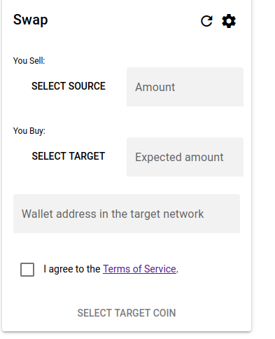

# Tranoo Swap User Guide

## Initiating a Swap

 

 1. Click <i>Select Source</i> button and select a source network and source coin.
 2. For the TON network as the source, you can press <i>Connect Wallet</i> at the top of the screen; we recommend using the TonKeeper wallet.
 3. In the <i>Amount</i> field, input how many coins you want to sell.
 4. Click <i>Select Target</i> button and select a target network and target coin.
 5. At the top of the form, you can choose <i>Standard Flow</i> with adaptive exchange rates or <i>Fixed Flow</i> for exact fixed time-limited exchange rate.
 6. Look at <i>Expected amount</i> and check how many target coins you will receive; for the Fixed Flow it will also show a time limit.
 7. In <i>Wallet address in the target network</i> field, paste the blockchain address in the target network which will receive funds.
 8. Check the checkbox to the left of <i>I agree to the Terms of Service</i> (which is a BSD3 License).
 9. Click <i>Proceed with Swap</i> button below the form to start a transaction. List of transactions being processed will appear below the form. Navigate to these to complete the transaction.

## Contact Support
### How to reach customer support for assistance

Technical Support e-mail is <a href="mailto:efilippov@gmail.com">efilippov@gmail.com</a>.

### Details on response times and support hours

I will process support requests as fast as I can.

## Data Privacy Policy
### Summary of how user data is handled and protected

All data doesn't leave your device except for transactions that are sent to ChangeNOW.io API. See their privacy policies.

## Feedback and Suggestions
### Encouragement for users to provide feedback on their experience with the platform

The e-mail for the feedback is <a href="mailto:efilippov@gmail.com">efilippov@gmail.com</a>.

